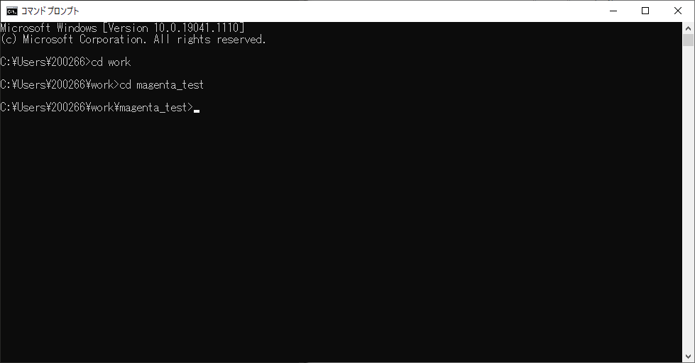

# 第一回 Magentaの環境構築

## Topic
- コマンドプロンプトで仮想環境の構築
- tensorflowとmagentaのインストール

### 1. 仮想環境の構築

windowsメニューからコマンドプロンプトを起動します

作業したいフォルダのなかに入ったら

`python -m venv 仮想環境名`を実行します。

pythonのバージョンは3.7系をインストールしてください
実行前にあらかじめ環境PATHにpythonを入れといてください

次に仮想環境を有効化します

`仮想環境名\Scripts\activate` を実行します
ちなみに無効化はdeactivateです

仮想環境を有効化したらライブラリのインストールを行います

- tensorflow `pip install tensorflow`
- magenta `pip install magenta`

もしライブラリのバージョンに関するエラーが起こった場合
以下のいずれかを実行

- 一回コマンドプロンプトを閉じる
- バージョンを指定して実行 `pip install tensorflow == 0.7.0`
